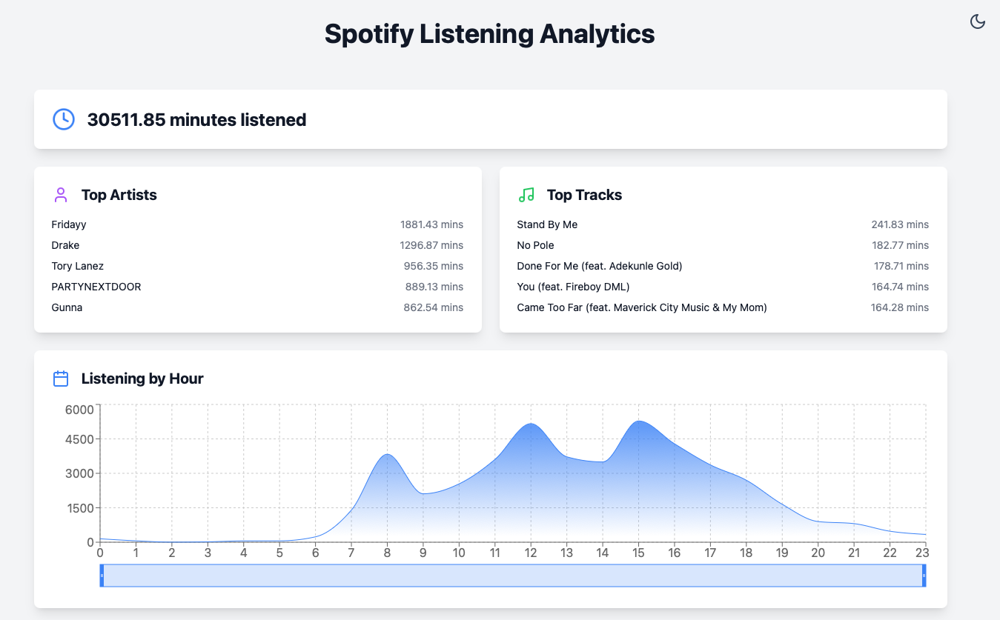

# Wavelytics

A sleek, interactive dashboard for visualizing your Spotify listening history. Upload your Spotify data and get beautiful visualizations of your listening habits powered by Wavelytics.



## 🚀 Features

- 📊 Interactive visualizations of your Spotify listening data
- 🎧 View your top artists and tracks
- 📅 See listening patterns by hour and month
- 🔍 Zoom and pan through your listening history with interactive sliders
- 🌓 Light/Dark theme toggle
- 📱 Fully responsive design

## 📋 Prerequisites

- Node.js (v16.x or later)
- npm or yarn
- A Spotify account (for your own data)

## 🛠️ Installation

1. Clone the repository:
```bash
git clone https://github.com/your-username/wavelytics.git
cd wavelytics
```

2. Install dependencies:
```bash
npm install
# or
yarn
```

3. Start the development server:
```bash
npm run dev
# or
yarn dev
```

4. Open your browser and navigate to `http://localhost:5173`

## 📦 Building for Production

```bash
npm run build
# or
yarn build
```

The built files will be in the `dist` directory.

## 🧪 Quick Start

### Try with Sample Data
If you want to test the application immediately:
1. Navigate to `docs/sample-data/`
2. Use the provided `sample-streaming-data` file
3. Upload it to the application to see it in action

### Get Your Own Spotify Data
For detailed instructions on getting your Spotify data, see our comprehensive guide:
**[📖 Getting Started Guide](docs/GETTING_STARTED.md)**

The guide includes:
- Step-by-step screenshots for requesting your data
- Understanding your data structure
- Troubleshooting common issues
- Privacy and security information

## 🧰 Tech Stack

- ⚛️ React
- 📊 Recharts for data visualization
- 🎨 TailwindCSS for styling
- 🔄 Framer Motion for animations
- 📦 Vite for fast development and building

## 🤝 Contributing

Contributions, issues, and feature requests are welcome! Feel free to check the [issues page](https://github.com/your-username/wavelytics/issues).

## 📝 License

This project is [MIT](LICENSE) licensed.

## 🙏 Acknowledgements

- [Spotify](https://www.spotify.com/) for providing user data export
- [Recharts](https://recharts.org/) for the excellent charting library
- [TailwindCSS](https://tailwindcss.com/) for the utility-first CSS framework
- [Framer Motion](https://www.framer.com/motion/) for the animation library 