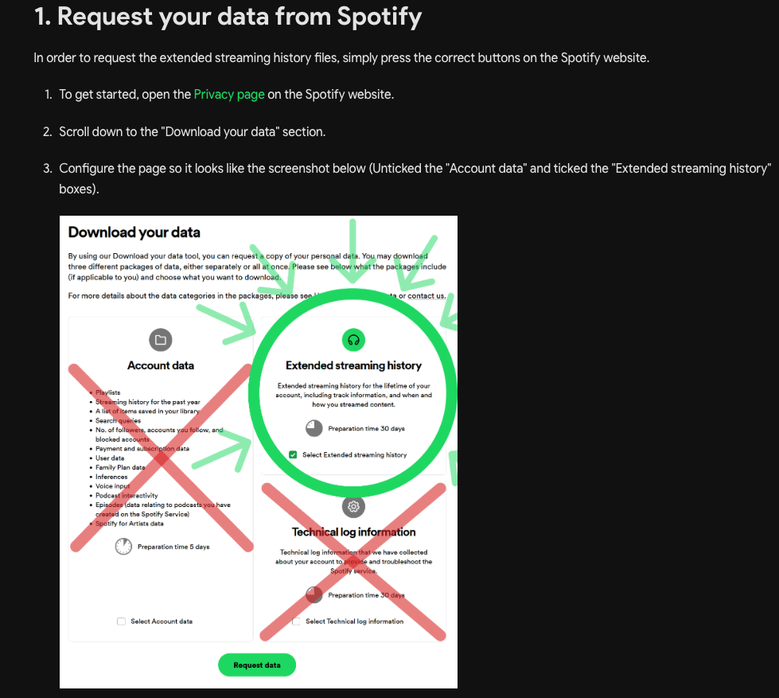
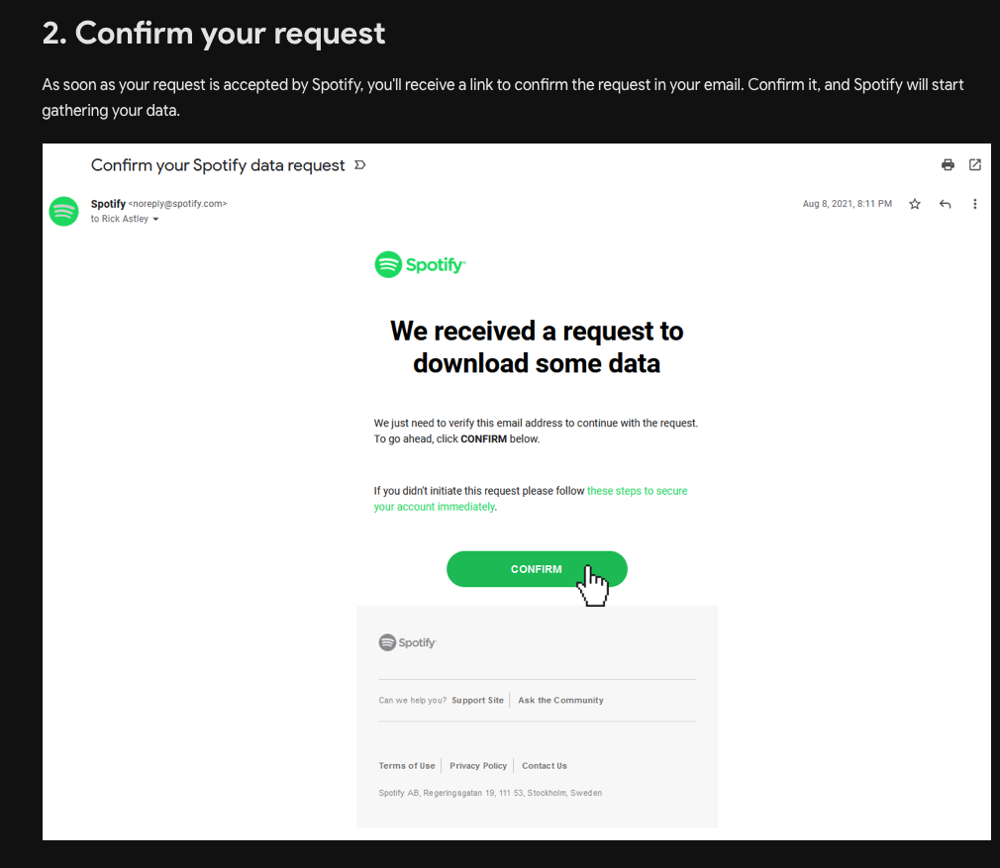
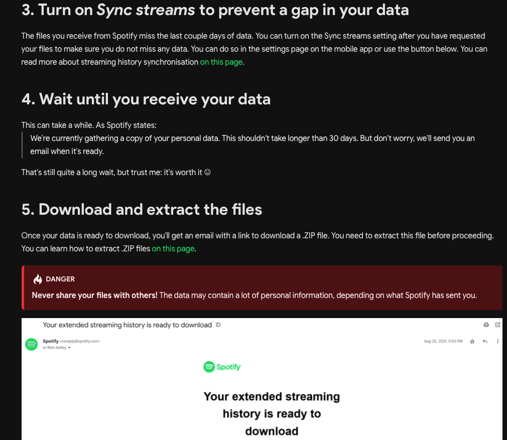

# Getting Started with Spotify by the Numbers

This guide will walk you through the process of getting your Spotify data and using the analytics dashboard.

## 📋 Prerequisites

- A Spotify account
- Access to your Spotify account settings
- Basic knowledge of file management

## 🎯 Step-by-Step Guide

### Step 1: Request Your Spotify Data

1. Go to your [Spotify Account](https://www.spotify.com/account/privacy/) page
2. Scroll down to the "Download your data" section
3. Click on "Request" to start the data export process



### Step 2: Confirm Your Request

1. You'll receive an email from Spotify confirming your data request
2. Click the confirmation link in the email
3. Spotify will begin processing your data (this can take up to 30 days)



### Step 3: Download Your Data

1. Once processing is complete, you'll receive another email with download links
2. Download the ZIP file containing your data
3. Extract the ZIP file to access your data



## 📁 Understanding Your Data

After extracting the ZIP file, you'll find a folder structure like this:

```
MyData/
├── StreamingHistory0.json
├── StreamingHistory1.json
├── Userdata.json
└── ... (other files)
```

**Important**: For this dashboard, you'll need the `StreamingHistory*.json` files.

## 🧪 Try with Sample Data

If you want to test the application before getting your own data, you can use the provided sample data:

1. Navigate to the `docs/sample-data/` folder
2. Use the `sample-streaming-data` file as your test data
3. Upload it to the application to see how it works

## 🚀 Using the Application

1. **Start the application**:
   ```bash
   npm run dev
   ```

2. **Upload your data**:
   - Click the upload button
   - Select one of your `StreamingHistory*.json` files
   - The dashboard will automatically load your data

3. **Explore your insights**:
   - View your top artists and tracks
   - See listening patterns by hour and month
   - Use the interactive sliders to zoom into specific time periods
   - Toggle between light and dark themes

## 🔍 Data Privacy

- Your data is processed locally in your browser
- No data is sent to external servers
- You can safely use this application with your personal Spotify data

## ❓ Troubleshooting

**Q: My data file is too large**
A: The application can handle large files, but if you experience performance issues, try using a smaller time range from your data.

**Q: The charts aren't loading**
A: Make sure you're uploading a valid `StreamingHistory*.json` file from your Spotify data export.

**Q: I don't see my recent listening data**
A: Spotify data exports can take up to 30 days to process and may not include the most recent listening activity.

## 📞 Support

If you encounter any issues:
1. Check that your data file is in the correct format
2. Ensure you're using a modern web browser
3. Try refreshing the page and uploading again
4. Open an issue on the GitHub repository

---

**Note**: This application is for personal use only. Please respect Spotify's terms of service and your data privacy. 